# Modular Monolith with DDD in NestJS

### Motivation

This project demonstrates how to build a modular monolith in NestJS using well-established architectural patterns such as:

* Domain-Driven Design (DDD)
* CQRS (Command Query Responsibility Segregation)
* Hexagonal Architecture (Ports & Adapters)
* Onion Architecture (Application, Domain, Infrastructure layers)
* Clean Architecture principles

The goal is not to add unnecessary complexity, but to introduce structural discipline in systems where business logic matters.

### Live demo for tracing events from repository: https://demo.nestjstools.com

### This architecture is designed to:

* Protect the domain from framework and infrastructure concerns
* Enforce clear boundaries between modules
* Keep business rules independent from persistence and transport layers
* Enable long-term maintainability and evolution

### QuickLinks in repository:
* [Integration events dir](https://github.com/Sebastian-Iwanczyszyn/modular-monolith-with-ddd-nestjs/tree/main/libs/event/src)
* [Messaging dir](https://github.com/Sebastian-Iwanczyszyn/modular-monolith-with-ddd-nestjs/tree/main/src/common/messaging)
* [Message mapper](https://github.com/Sebastian-Iwanczyszyn/modular-monolith-with-ddd-nestjs/blob/main/src/message-mapper.ts)
* [Order dir](https://github.com/Sebastian-Iwanczyszyn/modular-monolith-with-ddd-nestjs/tree/main/src/modules/order)
* [Payment dir](https://github.com/Sebastian-Iwanczyszyn/modular-monolith-with-ddd-nestjs/tree/main/src/modules/payment)
* [UI](https://github.com/Sebastian-Iwanczyszyn/modular-monolith-with-ddd-nestjs/tree/main/src/ui)

## Run project
### To run this project locally, you need:

* Docker
* Docker Compose
```bash
git clone https://github.com/Sebastian-Iwanczyszyn/modular-monolith-with-ddd-nestjs.git
make start
```
## Core Libraries in-use
* MessageBus
  * https://www.npmjs.com/package/@nestjstools/messaging
  * https://www.npmjs.com/package/@nestjstools/messaging-rabbitmq-extension
* Typeorm https://typeorm.io/

## Execution Model in This Repository

### Command Handler Execution Flow


* Commands → sync
* Domain events → sync
* Queries → sync (no QueryBus)
* Integration events → async (RabbitMQ)

### Architecture Overview

```mermaid
flowchart TB

    %% Core
    subgraph Core["💎 Domain Core"]
        D1[Aggregates]
        D2[Value Objects]
        D3[Domain Events]
    end

    %% Application
    subgraph App["⚙️ Application Layer"]
        A1[Commands]
        A2[Queries]
        A3[Message Handlers]
        A4[Ports]
    end

    %% Adapters
    subgraph Inbound["🌐 UI"]
        I1[HTTP Controllers]
        I2[WebSocket Gateways]
    end

    subgraph Outbound["📡 Outbound Adapters"]
        O1[Repositories]
        O2[Message Bus]
        O3[RabbitMQ]
    end

    %% Flow
    Inbound --> App
    App --> Core
    App --> Outbound
```



---

## Terminology

### Domain Events

Domain events represent meaningful facts that occurred inside the domain.
They are emitted by aggregates when business invariants are satisfied and state changes occur.

Examples:

* [OrderCreated](https://github.com/Sebastian-Iwanczyszyn/modular-monolith-with-ddd-nestjs/blob/main/src/modules/order/domain/event.ts)
* [PaymentCreated](https://github.com/Sebastian-Iwanczyszyn/modular-monolith-with-ddd-nestjs/blob/main/src/modules/payment/domain/event.ts)

Domain events:

* Are part of the domain model
* Express business language
* Are collected inside aggregates
* Are dispatched by the application layer
* **Are handled synchronously within the same process after store aggregate state**

In this repository, domain events are dispatched **synchronously**.
They model **what happened**, not what should happen.

---

### Integration Events

Integration events are used to communicate between modules or external systems.

They are derived from domain events but are designed for cross-boundary communication (placed in `lib` dir).

Unlike domain events, integration events:


* May have flattened or transformed payloads
* Represent public contracts
* Are intended for inter-module or inter-service communication
* **Are published asynchronously via a message broker (RabbitMQ)**

Examples:
[OrderCreatedIntegrationEvent](https://github.com/Sebastian-Iwanczyszyn/modular-monolith-with-ddd-nestjs/blob/main/libs/event/src/order/integration-event.ts)

In this repository, integration events are published asynchronously using **RabbitMQ**.
They are emitted after domain processing completes and are delivered through the messaging infrastructure to ensure loose coupling and eventual consistency.

In short:

Domain events are internal and synchronous.
Integration events are external and asynchronous.

---

### Commands

Commands represent an intention to perform an action that **may change state**.

They belong to the **write side** in CQRS.

Examples:

* `CreateOrder`
* `CreatePayment`

A command:

* Expresses intent (what we want to do)
* Is handled by **exactly one** command handler
* Validates input at the application boundary
* Orchestrates domain logic (aggregates, repositories, policies)
* May produce **events** as a result of state changes

Commands should not return values.

---

### Query

Queries represent **read-only operations**.

They belong to the **read side** in CQRS.

Queries:

* Do not modify state
* Do not emit domain events
* Are optimized for read performance
* May use dedicated read models

In this repository, queries are handled **synchronously** and **do not use a QueryBus**.

This is a deliberate pragmatic decision.
Because queries are simple and synchronous, introducing a QueryBus would add unnecessary indirection without architectural benefit.

Instead, queries are executed through a **port/adapter approach**:

* The application defines a query port (interface)
* Infrastructure provides the concrete implementation (e.g., database access)
* The read model remains isolated from the domain

This keeps the architecture clean while avoiding overengineering.

CQRS is applied where it adds clarity - not where it adds ceremony.

---

### [MessageBus](https://github.com/Sebastian-Iwanczyszyn/modular-monolith-with-ddd-nestjs/blob/main/src/common/messaging/messaging-wrapper.module.ts)

The MessageBus is the abstraction responsible for dispatching **commands** and propagating **events**.

It decouples senders from handlers and provides a consistent entry point for application messaging.

In this repository, the MessageBus supports:

* **Command dispatching** (synchronous, in-process)
* **Domain event dispatching** (synchronous, in-process)
* **Integration event publishing** (asynchronous, via RabbitMQ)

The MessageBus belongs to the application layer and is consumed through ports/interfaces.
Concrete transport (e.g., RabbitMQ) is an infrastructure concern implemented via adapters.

In short:
MessageBus defines *how the application communicates internally and externally* without coupling the domain to transport details.

---

### UI Layer

The UI layer represents the **entry points** to the system.

In this repository, the UI layer consists of:

* **HTTP controllers**
* **WebSocket gateways**

The UI layer is responsible for:

* Receiving external requests
* Performing basic validation and transformation
* Translating transport-specific input into commands or queries
* Delegating execution to the application layer

---

### Domain Layer

The Domain layer is the core of the system.
It contains only business logic and domain concepts, such as:

* Aggregates
* Value Objects
* Domain Services
* Domain Events
* Value Objects

The domain:

* Does not depend on NestJS
* Does not depend on databases
* Does not depend on HTTP or WebSockets
* Does not depend on message brokers
* Does not import infrastructure libraries (or it should be very minimal if necessary)

It is pure TypeScript and represents the business model in isolation.

The domain layer:

* Enforces invariants
* Protects consistency rules
* Encapsulates state transitions
* Produces domain events

It does not orchestrate workflows (that is the application layer’s responsibility).
It does not handle transport concerns (that belongs to the UI layer).
It does not perform persistence (that belongs to infrastructure).

The domain exists to model and protect business rules - nothing else.

If the framework or database changes, the domain should remain untouched.

---

### Application Layer

The Application layer orchestrates the system’s behavior.

It sits between the UI layer (HTTP/WebSocket) and the domain, and is responsible for executing **use cases**.

It typically contains:

* Command handlers (write side)
* Query ports (interfaces) for read operations
* Domain event dispatching coordination
* Integration event publishing coordination
* Transaction boundaries (when applicable)

The application layer:

* Translates commands into domain operations
* Loads and persists aggregates through repository ports
* Dispatches **domain events synchronously** (in-process)
* Publishes **integration events asynchronously** (via RabbitMQ)
* Keeps workflow logic outside the domain

The application layer does **not** contain business rules themselves.
Business rules live in the domain; the application layer only coordinates them.

In this repository:

* **Commands** are executed **synchronously** (in-process)
* **Queries** are executed **synchronously** via **port/adapter** (no QueryBus for pragmatic simplicity)

---

### Infrastructure Layer

The Infrastructure layer contains all technical details and external integrations.

It provides implementations for the ports defined by the application/domain layers and hosts the delivery mechanisms (UI).

This includes:

* HTTP controllers and WebSocket gateways (UI adapters)
* Database repositories (ORM/SQL implementations)
* Message broker adapters (RabbitMQ publishers/consumers)
* External API clients (HTTP/gRPC SDK adapters)
* Framework wiring (Nest modules, DI configuration, providers)

Infrastructure:

* Depends on application and domain
* Implements ports as adapters
* Can be replaced without changing business logic
* Is allowed to use frameworks and libraries freely

In other words:
Infrastructure is the “plug-in layer” - it makes the system runnable in the real world, but it must not leak into the domain.

---

## Repository does not include

This repository is intentionally focused on showcasing architecture and boundaries.
To keep the demo lightweight, it **does not include**:

* **Outbox/Inbox pattern** (reliable event delivery and deduplication)
* **Separate worker process for async workloads** (background processing runs are not split into a dedicated service)
* **Split runtimes per UI layer** (HTTP and WebSocket are not deployed/run as separate applications)
* **Authentication / Authorization** (no identity provider, guards, RBAC, etc.)

